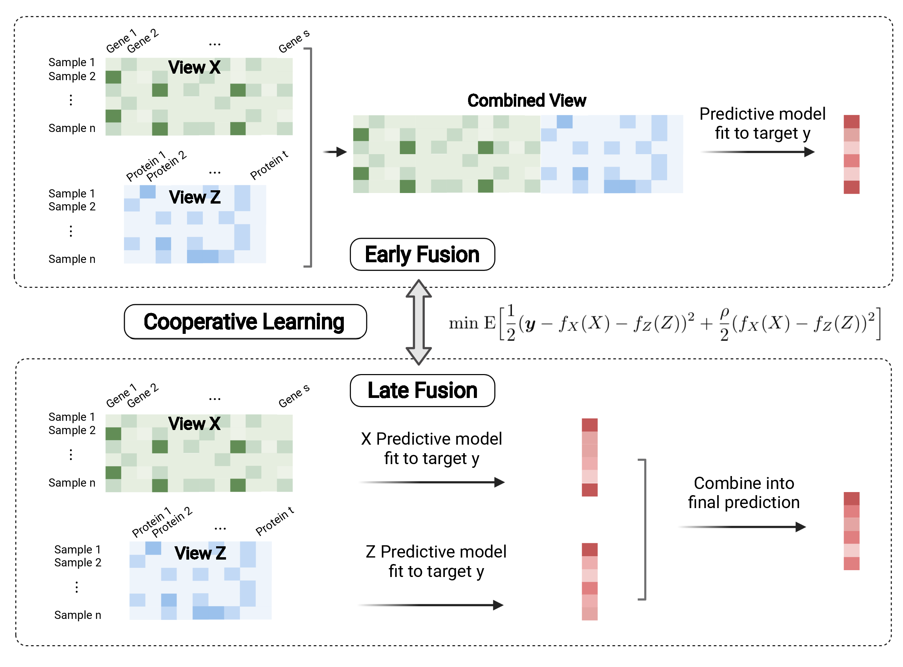

# Cooperative Learning In Argentinian Risk Scoring Dataset

Introduction
--------
This repository seeks to evaluate the method: [Cooperative Learning] for multiview data on a credit risk scoring data set, comparing it with traditional supervised learning methods.

Cooperative learning combines the usual squared error loss of predictions with an ''agreement'' penalty to encourage the predictions from different data views to agree. The method can be especially powerful when the different data views share some underlying relationship in their signals that can be exploited to boost the signals.

Unlike traditional ensemble methods, where individual models work independently and their outputs are combined later, cooperative learning enables models to learn from each other iteratively. This collaborative interaction allows the models to correct each other's weaknesses, resulting in more accurate and generalized predictions.

*https://tibshirani.su.domains/multiview/files/image/early_late.png*

Executive summary of the analysis
--------

- A database of a random sample of 23,857 tax identification numbers (CUITs) is analyzed. Past financial behavior is used to predict default. The percent of default in the dataset is 9.6%.
- Variable distributions and associations with the response are summarized.
- There is a clear (marginal) association between default and some variables ('col_3', 'col_2', 'col_6', 'col_8', 'col_17', 'col_20', 'col_21', 'col_22', 'col_2' and 'col_26') 
)
- The dataset was divided in training and testing sets in a 70-30 ratio.
- The Cooperative Learning model performance was compared with a Stepwise Logistic Regression model performance and a Random Forest model performance according to RMSE, AUC, and Lift 5%. Also a Accuracy, Recall, Precision and F1 Score were calculate for all models using the proportion of events in the training set as the probability threshold
- Different Cooperative Learning models were fitted varying the penalty parameter $\rho$. 
- The best performance of Cooperative Learning models was using a value of $\rho$ equal to 0.7, but Stepwise Logistic Regression outperformed all models on RMSE, AUC, and Lift 5%. 

The complete analysis can be found [here](src/cooperative_learning_md.md)

Folder Structure
--------
The project is organized into the following folders:

    coop_learinig_in_risk_scoring
    |
    |- data/    
    |- results/
    |- scratch/
    |- src/   
    |
    |- README.md                   # folder description
    
    
References
--------
- [Cooperative learning for multi-view analysis](https://arxiv.org/abs/2112.12337). Ding, Daisy Yi, Shuangning Li, Balasubramanian Narasimhan, and Robert Tibshirani. PNAS, September 12, 2022. 119 (38) e2202113119

[Cooperative Learning]: https://tibshirani.su.domains/multiview/CoopLearning.html

