# Cooperative Learning
Leandro Kovalevski

- [Executive summary](#executive-summary)
- [Dataset description.](#dataset-description.)
- [Settings](#settings)
- [Exploratory Data Analysis](#exploratory-data-analysis)
  - [General descriptive analysis.](#general-descriptive-analysis.)
  - [Response descriptive analysis.](#response-descriptive-analysis.)
  - [Descriptive analysis of categorical
    predictors](#descriptive-analysis-of-categorical-predictors)
  - [Descriptive analysis of quantitative
    predictors](#descriptive-analysis-of-quantitative-predictors)

# Executive summary

- to be completed..
- …
- …

``` r
file_name <- "df_bcra.rds"
```

This report was run with the **objetive** of describing the bcra
dataset:

- **Run date**: 2024-06-20

- **Dataset**: df_bcra.rds

# Dataset description.

The database consists of a random sample of 23,857 tax identification
numbers (CUITs) belonging to individuals who had at least one debt in
the Argentine financial system in June 2019, and were in credit
situation 1 or 2 (meaning they did not have overdue payments exceeding
90 days), obtained from the debtor database provided by the Central Bank
of the Argentine Republic (BCRA) for the period of June 2019. For the
tax identification numbers in the random sample, debts in all entities
were recorded and summarized for June 2019, as well as for the previous
6 months. Debts of these tax identification numbers between July 2019
and June 2020 were also recorded to assess their evolution. The response
variable is a binary variable constructed from the most severe credit
situation of the tax identification number (CUIT) between the periods of
July 2019 and June 2020. The variable takes the value 1 if the most
severe credit situation is greater than or equal to 3 in any debt any
period, and 0 otherwise. In the dataset ‘df_bcra.rds’, the information
recorded with 28 variables is available. The data is anonymized and
variable names are not displayed.

# Settings

``` r
#' ## Load data and needed packages.

#' Install (if needed)  'here' package to use relative paths. 
if(!("here" %in% installed.packages()[, "Package"])){ 
  install.packages("here") 
  }

#' Load generic functions ----
source(here::here("src", "utils.R"), encoding = "UTF-8")

#' Cargar las librerías necesarias
loadPackages(c(
  "here", "multiview", "ggplot2", "knitr", "scales", "dplyr", "doBy", "moments",
  "gains", "ROCR", "skimr", "moments", "corrplot"
  ))

#' Set data path
file_path <- here::here("data", "ready")


#' Set data file names
if( !exists("file_name") ){
  file_name <- "df_bcra.rds"
}

#' read data
df <- readRDS(file.path(file_path, file_name))
```

# Exploratory Data Analysis

## General descriptive analysis.

``` r
skim(df)
```

|                                                  |       |
|:-------------------------------------------------|:------|
| Name                                             | df    |
| Number of rows                                   | 23857 |
| Number of columns                                | 28    |
| \_\_\_\_\_\_\_\_\_\_\_\_\_\_\_\_\_\_\_\_\_\_\_   |       |
| Column type frequency:                           |       |
| character                                        | 1     |
| factor                                           | 5     |
| numeric                                          | 22    |
| \_\_\_\_\_\_\_\_\_\_\_\_\_\_\_\_\_\_\_\_\_\_\_\_ |       |
| Group variables                                  | None  |

Data summary

**Variable type: character**

| skim_variable | n_missing | complete_rate | min | max | empty | n_unique | whitespace |
|:--------------|----------:|--------------:|----:|----:|------:|---------:|-----------:|
| col_1         |         0 |             1 |   2 |   2 |     0 |        4 |          0 |

**Variable type: factor**

| skim_variable | n_missing | complete_rate | ordered | n_unique | top_counts                        |
|:--------------|----------:|--------------:|:--------|---------:|:----------------------------------|
| col_6         |         0 |          1.00 | FALSE   |        2 | 1: 22744, 2: 1113, 3: 0, 4: 0     |
| col_8         |         0 |          1.00 | FALSE   |        2 | 0: 22582, 1: 1275                 |
| col_17        |         0 |          1.00 | FALSE   |        5 | 1: 20544, 2: 2281, 3: 434, 5: 331 |
| col_18        |     22369 |          0.06 | FALSE   |        5 | 1: 1397, 2: 82, 3: 6, 4: 2        |
| col_19        |       224 |          0.99 | FALSE   |        5 | 1: 20382, 2: 2225, 3: 430, 5: 331 |

**Variable type: numeric**

| skim_variable | n_missing | complete_rate |     mean |      sd |  p0 |     p25 |      p50 |      p75 |      p100 | hist  |
|:--------------|----------:|--------------:|---------:|--------:|----:|--------:|---------:|---------:|----------:|:------|
| col_2         |         0 |             1 |     1.72 |    1.06 |   1 |    1.00 |     1.00 |     2.00 |     10.00 | ▇▂▁▁▁ |
| col_3         |         0 |             1 |   239.83 |  167.09 |   0 |  130.00 |   228.00 |   308.00 |    959.00 | ▆▇▁▁▁ |
| col_4         |         0 |             1 |   126.25 | 4589.79 |   1 |   11.00 |    31.00 |    83.00 | 707012.00 | ▇▁▁▁▁ |
| col_5         |         0 |             1 |    29.42 |  299.40 |   0 |    0.00 |     0.00 |     0.00 |  15335.00 | ▇▁▁▁▁ |
| col_7         |         0 |             1 |     0.04 |    0.18 |   0 |    0.00 |     0.00 |     0.00 |      1.00 | ▇▁▁▁▁ |
| col_9         |         0 |             1 |     0.05 |    0.21 |   0 |    0.00 |     0.00 |     0.00 |      1.00 | ▇▁▁▁▁ |
| col_10        |         0 |             1 |     6.47 |    1.15 |   1 |    6.00 |     7.00 |     7.00 |      7.00 | ▁▁▁▁▇ |
| col_11        |         0 |             1 |   107.60 | 2311.59 |   1 |   13.00 |    32.14 |    81.29 | 353507.00 | ▇▁▁▁▁ |
| col_12        |         0 |             1 |   105.07 | 2309.24 |   0 |   12.33 |    31.29 |    79.43 | 353507.00 | ▇▁▁▁▁ |
| col_13        |         0 |             1 |     1.96 |   69.89 |   0 |    0.00 |     0.00 |     0.00 |  10609.00 | ▇▁▁▁▁ |
| col_14        |         0 |             1 |    21.99 |  241.68 |   0 |    0.00 |     0.00 |     0.00 |  13519.71 | ▇▁▁▁▁ |
| col_15        |         0 |             1 |    85.60 | 2296.18 |   0 |   12.00 |    29.71 |    72.43 | 353507.00 | ▇▁▁▁▁ |
| col_16        |         0 |             1 |     0.56 |   17.78 |   0 |    0.00 |     0.00 |     0.00 |   2532.14 | ▇▁▁▁▁ |
| col_20        |         0 |             1 |     0.97 |    0.10 |   0 |    1.00 |     1.00 |     1.00 |      1.00 | ▁▁▁▁▇ |
| col_21        |         0 |             1 |     0.02 |    0.07 |   0 |    0.00 |     0.00 |     0.00 |      1.00 | ▇▁▁▁▁ |
| col_22        |         0 |             1 |     0.01 |    0.05 |   0 |    0.00 |     0.00 |     0.00 |      0.86 | ▇▁▁▁▁ |
| col_23        |         0 |             1 |     0.04 |    0.17 |   0 |    0.00 |     0.00 |     0.00 |      1.00 | ▇▁▁▁▁ |
| col_24        |         0 |             1 |     0.05 |    0.21 |   0 |    0.00 |     0.00 |     0.00 |      1.00 | ▇▁▁▁▁ |
| col_25        |         0 |             1 |     0.05 |    0.15 |   0 |    0.00 |     0.00 |     0.00 |      1.00 | ▇▁▁▁▁ |
| col_26        |         0 |             1 |     0.02 |    0.10 |   0 |    0.00 |     0.00 |     0.00 |      0.86 | ▇▁▁▁▁ |
| response      |         0 |             1 |     0.10 |    0.29 |   0 |    0.00 |     0.00 |     0.00 |      1.00 | ▇▁▁▁▁ |
| id            |         0 |             1 | 11929.00 | 6887.07 |   1 | 5965.00 | 11929.00 | 17893.00 |  23857.00 | ▇▇▇▇▇ |

## Response descriptive analysis.

To analyze the default, we use the variable: **‘response’**, which take
the following values:

- **0**: if the most severe credit situation is always less than 3
  (always the payment delay is less than 90 days).
- **1**: if the most severe credit situation is greater than or equal to
  3 in any debt any period.

``` r
response <- "response"

cat(paste0("\n### Response variabe: **", response, "**.\n"))
```

### Response variabe: **response**.

``` r
describeCategorical(
  data         = df,
  var          = response,
  bar_color    = "#fff159" 
  ) 
```

Analyzing the most frequent values of ‘response’ reveals that 21569
(90.4%) of records have ‘response’ equal to ‘*0*’, while 9.6% have
‘response’ equal to ‘*1*’ (Table 1.1).

### Table 1.1. Count and percentage of records by ‘response’.

| response | Count records | Percentage |
|:---------|--------------:|-----------:|
| 0        |         21569 |      90.4% |
| 1        |          2288 |       9.6% |

    Warning: Using `size` aesthetic for lines was deprecated in ggplot2 3.4.0.
    ℹ Please use `linewidth` instead.

### Figure 1.1. Percentage of records by response.


``` r
cat("\n")
```

``` r
cat("\n")
```

## Descriptive analysis of categorical predictors

``` r
#' Identify categorical and quantitavie variables
nvars <- names(df)[(sapply(X = df, FUN = class)) %in% 
                     c("integer", "numeric", "double") ]
cvars <- names(df)[(sapply(X = df, FUN = class)) %in% 
                     c("character", "factor", "logical", "text") ]

for (var in cvars){
  
  describeCategoricalAndBinary(
    data    = df, 
    var     = var, 
    binary  = response,
    ti      = which(cvars == var), 
    gi      = which(cvars == var)
    )
}
```

### Variable: **col_1**.

Analyzing the most frequent values of ‘col_1’ reveals that 10774 (45.2%)
of records have ‘col_1’ equal to ‘*20*’, while 45.0% have ‘col_1’ equal
to ‘*27*’, and 9.4% have ‘col_1’ equal to ‘*23*’ (Table 1.1).

**The highest percentage of ‘response’ is for ‘*20*’ with: 9.7%**. The
next highest percentage is for: ‘*27*’, with: 9.6% (Table 1.1).

### Table 1.1. Count (and percentage) of rds and proportion of events for ‘response’ by ‘col_1’.

| col_1 | n (percentage %) | response |
|:------|-----------------:|---------:|
| 20    |    10774 (45.2%) |    0.097 |
| 23    |      2234 (9.4%) |    0.093 |
| 24    |       116 (0.5%) |    0.034 |
| 27    |    10733 (45.0%) |    0.096 |

    Warning: The `size` argument of `element_line()` is deprecated as of ggplot2 3.4.0.
    ℹ Please use the `linewidth` argument instead.

### Figure 1.1. Percentage of rds by col_1.

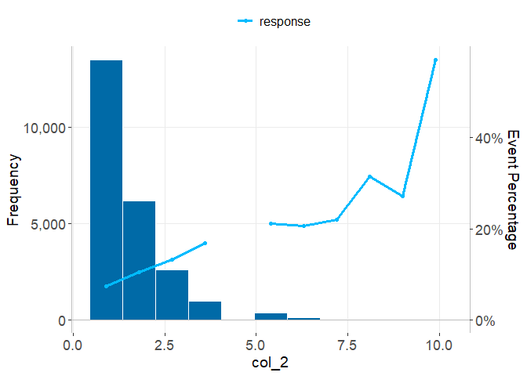

### Variable: **col_6**.

Analyzing the most frequent values of ‘col_6’ reveals that 22744 (95.3%)
of records have ‘col_6’ equal to ‘*1*’, while 4.7% have ‘col_6’ equal to
‘*2*’ (Table 1.2).

**The highest percentage of ‘response’ is for ‘*2*’ with: 59.7%**. The
next highest percentage is for: ‘*1*’, with: 7.1% (Table 1.2).

### Table 1.2. Count (and percentage) of rds and proportion of events for ‘response’ by ‘col_6’.

| col_6 | n (percentage %) | response |
|:------|-----------------:|---------:|
| 1     |    22744 (95.3%) |    0.071 |
| 2     |      1113 (4.7%) |    0.597 |

### Figure 1.2. Percentage of rds by col_6.


### Variable: **col_8**.

Analyzing the most frequent values of ‘col_8’ reveals that 22582 (94.7%)
of records have ‘col_8’ equal to ‘*0*’, while 5.3% have ‘col_8’ equal to
‘*1*’ (Table 1.3).

**The highest percentage of ‘response’ is for ‘*0*’ with: 9.8%**. The
next highest percentage is for: ‘*1*’, with: 6.7% (Table 1.3).

### Table 1.3. Count (and percentage) of rds and proportion of events for ‘response’ by ‘col_8’.

| col_8 | n (percentage %) | response |
|:------|-----------------:|---------:|
| 0     |    22582 (94.7%) |    0.098 |
| 1     |      1275 (5.3%) |    0.067 |

### Figure 1.3. Percentage of rds by col_8.

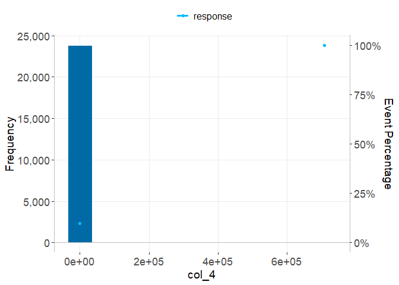

### Variable: **col_17**.

Analyzing the most frequent values of ‘col_17’ reveals that 20544
(86.1%) of records have ‘col_17’ equal to ‘*1*’, while 9.6% have
‘col_17’ equal to ‘*2*’, and 1.8% have ‘col_17’ equal to ‘*3*’ (Table
1.4).

**The highest percentage of ‘response’ is for ‘*5*’ with: 48.0%**. The
next highest percentage is for: ‘*3*’, with: 39.9% (Table 1.4).

### Table 1.4. Count (and percentage) of rds and proportion of events for ‘response’ by ‘col_17’.

| col_17 | n (percentage %) | response |
|:-------|-----------------:|---------:|
| 1      |    20544 (86.1%) |    0.049 |
| 2      |      2281 (9.6%) |    0.373 |
| 3      |       434 (1.8%) |    0.399 |
| 4      |       267 (1.1%) |    0.382 |
| 5      |       331 (1.4%) |    0.480 |

### Figure 1.4. Percentage of rds by col_17.


### Variable: **col_18**.

Analyzing the most frequent values of ‘col_18’ reveals that 22369
(93.8%) of records have ‘col_18’ equal to ‘*NA*’, while 5.9% have
‘col_18’ equal to ‘*1*’, and 0.3% have ‘col_18’ equal to ‘*2*’ (Table
1.5).

**The highest percentage of ‘response’ is for ‘*2*’ with: 34.1%**. The
next highest percentage is for: ‘*3*’, with: 16.7% (Table 1.5).

### Table 1.5. Count (and percentage) of rds and proportion of events for ‘response’ by ‘col_18’.

| col_18 | n (percentage %) | response |
|:-------|-----------------:|---------:|
| 1      |      1397 (5.9%) |    0.047 |
| 2      |        82 (0.3%) |    0.341 |
| 3      |         6 (0.0%) |    0.167 |
| 4      |         2 (0.0%) |    0.000 |
| 5      |         1 (0.0%) |    0.000 |
| NA     |    22369 (93.8%) |    0.098 |

### Figure 1.5. Percentage of rds by col_18.


### Variable: **col_19**.

Analyzing the most frequent values of ‘col_19’ reveals that 20382
(85.4%) of records have ‘col_19’ equal to ‘*1*’, while 9.3% have
‘col_19’ equal to ‘*2*’, and 1.8% have ‘col_19’ equal to ‘*3*’ (Table
1.6).

**The highest percentage of ‘response’ is for ‘*5*’ with: 48.0%**. The
next highest percentage is for: ‘*3*’, with: 40.2% (Table 1.6).

### Table 1.6. Count (and percentage) of rds and proportion of events for ‘response’ by ‘col_19’.

| col_19 | n (percentage %) | response |
|:-------|-----------------:|---------:|
| 1      |    20382 (85.4%) |    0.050 |
| 2      |      2225 (9.3%) |    0.377 |
| 3      |       430 (1.8%) |    0.402 |
| 4      |       265 (1.1%) |    0.385 |
| 5      |       331 (1.4%) |    0.480 |
| NA     |       224 (0.9%) |    0.027 |

### Figure 1.6. Percentage of rds by col_19.

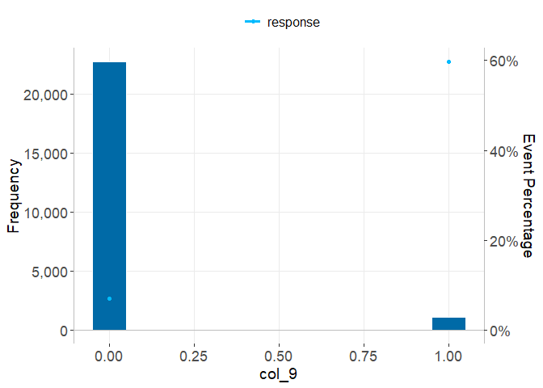

## Descriptive analysis of quantitative predictors

``` r
vars_to_exclude <- c( response, "id" )
nvars              <- nvars[!nvars %in% vars_to_exclude]


for (var in nvars){

  describeNumericAndBinaryResponse(
    data             = df, 
    var              = var, 
    binary        = response,
    ti               = which(cvars == var), 
    gi               = which(cvars == var), 
    )
}
```

### Variable: **col_2**.

**The highest percentage of ‘response’ occurs in the interval of
‘col_2’: ‘*9.45 - 10.35*’, with: 57.1%**. The next highest percentage is
in the interval: ‘*7.65 - 8.55*’, with: 31.6% (Table 1.).

### Table 1.. Count (and percentage) of rds and proportion of events for ‘responseaccording to different intervals of ’col_2’.

| col_2        | n (percentage %) | response |
|:-------------|-----------------:|---------:|
| 0.45 - 1.35  |    13476 (56.5%) |    0.074 |
| 1.35 - 2.25  |     6178 (25.9%) |    0.105 |
| 2.25 - 3.15  |     2619 (11.0%) |    0.132 |
| 3.15 - 4.05  |       980 (4.1%) |    0.168 |
| 4.05 - 4.95  |         0 (0.0%) |       NA |
| 4.95 - 5.85  |       377 (1.6%) |    0.212 |
| 5.85 - 6.75  |       131 (0.5%) |    0.206 |
| 6.75 - 7.65  |        59 (0.2%) |    0.220 |
| 7.65 - 8.55  |        19 (0.1%) |    0.316 |
| 8.55 - 9.45  |        11 (0.0%) |    0.273 |
| 9.45 - 10.35 |         7 (0.0%) |    0.571 |

### Figure 1.. Percentage of ‘response’ according to ‘col_2’ intervals.

    Warning: Removed 1 row containing missing values or values outside the scale range
    (`geom_point()`).

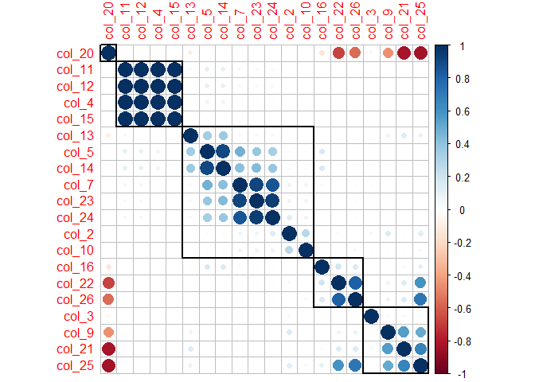

### Variable: **col_3**.

**The highest percentage of ‘response’ occurs in the interval of
‘col_3’: ‘*431.55 - 527.45*’, with: 21.7%**. The next highest percentage
is in the interval: ‘*335.65 - 431.55*’, with: 13.6% (Table 1.).

### Table 1.. Count (and percentage) of rds and proportion of events for ‘responseaccording to different intervals of ’col_3’.

| col_3            | n (percentage %) | response |
|:-----------------|-----------------:|---------:|
| -47.95 - 47.95   |       969 (4.1%) |    0.050 |
| 47.95 - 143.85   |     6087 (25.5%) |    0.072 |
| 143.85 - 239.75  |     5770 (24.2%) |    0.091 |
| 239.75 - 335.65  |     7012 (29.4%) |    0.105 |
| 335.65 - 431.55  |     3155 (13.2%) |    0.136 |
| 431.55 - 527.45  |        23 (0.1%) |    0.217 |
| 527.45 - 623.35  |         2 (0.0%) |    0.000 |
| 623.35 - 719.25  |         1 (0.0%) |    0.000 |
| 719.25 - 815.15  |         0 (0.0%) |       NA |
| 815.15 - 911.05  |         0 (0.0%) |       NA |
| 911.05 - 1006.95 |       838 (3.5%) |    0.125 |

### Figure 1.. Percentage of ‘response’ according to ‘col_3’ intervals.

    Warning: Removed 2 rows containing missing values or values outside the scale range
    (`geom_point()`).


### Variable: **col_4**.

**The highest percentage of ‘response’ occurs in the interval of
‘col_4’: ‘*671660.45 - 742361.55*’, with: 100.0%**. The next highest
percentage is in the interval: ‘*-35350.55 - 35350.55*’, with: 9.6%
(Table 1.).

### Table 1.. Count (and percentage) of rds and proportion of events for ‘responseaccording to different intervals of ’col_4’.

| col_4                 | n (percentage %) | response |
|:----------------------|-----------------:|---------:|
| -35350.55 - 35350.55  |   23856 (100.0%) |    0.096 |
| 35350.55 - 106051.65  |         0 (0.0%) |       NA |
| 106051.65 - 176752.75 |         0 (0.0%) |       NA |
| 176752.75 - 247453.85 |         0 (0.0%) |       NA |
| 247453.85 - 318154.95 |         0 (0.0%) |       NA |
| 318154.95 - 388856.05 |         0 (0.0%) |       NA |
| 388856.05 - 459557.15 |         0 (0.0%) |       NA |
| 459557.15 - 530258.25 |         0 (0.0%) |       NA |
| 530258.25 - 600959.35 |         0 (0.0%) |       NA |
| 600959.35 - 671660.45 |         0 (0.0%) |       NA |
| 671660.45 - 742361.55 |         1 (0.0%) |    1.000 |

### Figure 1.. Percentage of ‘response’ according to ‘col_4’ intervals.

    Warning: Removed 9 rows containing missing values or values outside the scale range
    (`geom_point()`).


### Variable: **col_5**.

**The highest percentage of ‘response’ occurs in the interval of
‘col_5’: ‘*14568.25 - 16101.75*’, with: 100.0%**. The next highest
percentage is in the interval: ‘*-766.75 - 766.75*’, with: 9.6% (Table
1.).

### Table 1.. Count (and percentage) of rds and proportion of events for ‘responseaccording to different intervals of ’col_5’.

| col_5               | n (percentage %) | response |
|:--------------------|-----------------:|---------:|
| -766.75 - 766.75    |    23633 (99.1%) |    0.096 |
| 766.75 - 2300.25    |       143 (0.6%) |    0.035 |
| 2300.25 - 3833.75   |        44 (0.2%) |    0.068 |
| 3833.75 - 5367.25   |        25 (0.1%) |    0.040 |
| 5367.25 - 6900.75   |         3 (0.0%) |    0.000 |
| 6900.75 - 8434.25   |         5 (0.0%) |    0.000 |
| 8434.25 - 9967.75   |         1 (0.0%) |    0.000 |
| 9967.75 - 11501.25  |         2 (0.0%) |    0.000 |
| 11501.25 - 13034.75 |         0 (0.0%) |       NA |
| 13034.75 - 14568.25 |         0 (0.0%) |       NA |
| 14568.25 - 16101.75 |         1 (0.0%) |    1.000 |

### Figure 1.. Percentage of ‘response’ according to ‘col_5’ intervals.

    Warning: Removed 2 rows containing missing values or values outside the scale range
    (`geom_point()`).


### Variable: **col_7**.

**The highest percentage of ‘response’ occurs in the interval of
‘col_7’: ‘*0.05 - 0.15*’, with: 15.2%**. The next highest percentage is
in the interval: ‘*0.25 - 0.35*’, with: 14.0% (Table 1.).

### Table 1.. Count (and percentage) of rds and proportion of events for ‘responseaccording to different intervals of ’col_7’.

| col_7        | n (percentage %) | response |
|:-------------|-----------------:|---------:|
| -0.05 - 0.05 |    22593 (94.7%) |    0.098 |
| 0.05 - 0.15  |        46 (0.2%) |    0.152 |
| 0.15 - 0.25  |        53 (0.2%) |    0.132 |
| 0.25 - 0.35  |        43 (0.2%) |    0.140 |
| 0.35 - 0.45  |        66 (0.3%) |    0.106 |
| 0.45 - 0.55  |        63 (0.3%) |    0.016 |
| 0.55 - 0.65  |        70 (0.3%) |    0.057 |
| 0.65 - 0.75  |       105 (0.4%) |    0.104 |
| 0.75 - 0.85  |        95 (0.4%) |    0.074 |
| 0.85 - 0.95  |       177 (0.7%) |    0.056 |
| 0.95 - 1.05  |       546 (2.3%) |    0.046 |

### Figure 1.. Percentage of ‘response’ according to ‘col_7’ intervals.

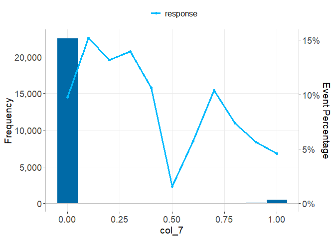

### Variable: **col_9**.

**The highest percentage of ‘response’ occurs in the interval of
‘col_9’: ‘*0.95 - 1.05*’, with: 59.7%**. The next highest percentage is
in the interval: ‘*-0.05 - 0.05*’, with: 7.1% (Table 1.).

### Table 1.. Count (and percentage) of rds and proportion of events for ‘responseaccording to different intervals of ’col_9’.

| col_9        | n (percentage %) | response |
|:-------------|-----------------:|---------:|
| -0.05 - 0.05 |    22744 (95.3%) |    0.071 |
| 0.05 - 0.15  |         0 (0.0%) |       NA |
| 0.15 - 0.25  |         0 (0.0%) |       NA |
| 0.25 - 0.35  |         0 (0.0%) |       NA |
| 0.35 - 0.45  |         0 (0.0%) |       NA |
| 0.45 - 0.55  |         0 (0.0%) |       NA |
| 0.55 - 0.65  |         0 (0.0%) |       NA |
| 0.65 - 0.75  |         0 (0.0%) |       NA |
| 0.75 - 0.85  |         0 (0.0%) |       NA |
| 0.85 - 0.95  |         0 (0.0%) |       NA |
| 0.95 - 1.05  |      1113 (4.7%) |    0.597 |

### Figure 1.. Percentage of ‘response’ according to ‘col_9’ intervals.

    Warning: Removed 9 rows containing missing values or values outside the scale range
    (`geom_point()`).


### Variable: **col_10**.

**The highest percentage of ‘response’ occurs in the interval of
‘col_10’: ‘*2.7 - 3.3*’, with: 15.3%**. The next highest percentage is
in the interval: ‘*0.9 - 1.5*’, with: 11.8% (Table 1.).

### Table 1.. Count (and percentage) of rds and proportion of events for ‘responseaccording to different intervals of ’col_10’.

| col_10    | n (percentage %) | response |
|:----------|-----------------:|---------:|
| 0.9 - 1.5 |       211 (0.9%) |    0.118 |
| 1.5 - 2.1 |       545 (2.3%) |    0.097 |
| 2.1 - 2.7 |         0 (0.0%) |       NA |
| 2.7 - 3.3 |       359 (1.5%) |    0.153 |
| 3.3 - 3.9 |         0 (0.0%) |       NA |
| 3.9 - 4.5 |       423 (1.8%) |    0.097 |
| 4.5 - 5.1 |       754 (3.2%) |    0.102 |
| 5.1 - 5.7 |         0 (0.0%) |       NA |
| 5.7 - 6.3 |     4468 (18.7%) |    0.071 |
| 6.3 - 6.9 |         0 (0.0%) |       NA |
| 6.9 - 7.5 |    17097 (71.7%) |    0.101 |

### Figure 1.. Percentage of ‘response’ according to ‘col_10’ intervals.

    Warning: Removed 4 rows containing missing values or values outside the scale range
    (`geom_point()`).


### Variable: **col_11**.

**The highest percentage of ‘response’ occurs in the interval of
‘col_11’: ‘*335830.7 - 371181.3*’, with: 100.0%**. The next highest
percentage is in the interval: ‘*-17675.3 - 17675.3*’, with: 9.6% (Table
1.).

### Table 1.. Count (and percentage) of rds and proportion of events for ‘responseaccording to different intervals of ’col_11’.

| col_11              | n (percentage %) | response |
|:--------------------|-----------------:|---------:|
| -17675.3 - 17675.3  |   23856 (100.0%) |    0.096 |
| 17675.3 - 53025.9   |         0 (0.0%) |       NA |
| 53025.9 - 88376.5   |         0 (0.0%) |       NA |
| 88376.5 - 123727.1  |         0 (0.0%) |       NA |
| 123727.1 - 159077.7 |         0 (0.0%) |       NA |
| 159077.7 - 194428.3 |         0 (0.0%) |       NA |
| 194428.3 - 229778.9 |         0 (0.0%) |       NA |
| 229778.9 - 265129.5 |         0 (0.0%) |       NA |
| 265129.5 - 300480.1 |         0 (0.0%) |       NA |
| 300480.1 - 335830.7 |         0 (0.0%) |       NA |
| 335830.7 - 371181.3 |         1 (0.0%) |    1.000 |

### Figure 1.. Percentage of ‘response’ according to ‘col_11’ intervals.

    Warning: Removed 9 rows containing missing values or values outside the scale range
    (`geom_point()`).


### Variable: **col_12**.

**The highest percentage of ‘response’ occurs in the interval of
‘col_12’: ‘*335831.65 - 371182.35*’, with: 100.0%**. The next highest
percentage is in the interval: ‘*-17675.35 - 17675.35*’, with: 9.6%
(Table 1.).

### Table 1.. Count (and percentage) of rds and proportion of events for ‘responseaccording to different intervals of ’col_12’.

| col_12                | n (percentage %) | response |
|:----------------------|-----------------:|---------:|
| -17675.35 - 17675.35  |   23856 (100.0%) |    0.096 |
| 17675.35 - 53026.05   |         0 (0.0%) |       NA |
| 53026.05 - 88376.75   |         0 (0.0%) |       NA |
| 88376.75 - 123727.45  |         0 (0.0%) |       NA |
| 123727.45 - 159078.15 |         0 (0.0%) |       NA |
| 159078.15 - 194428.85 |         0 (0.0%) |       NA |
| 194428.85 - 229779.55 |         0 (0.0%) |       NA |
| 229779.55 - 265130.25 |         0 (0.0%) |       NA |
| 265130.25 - 300480.95 |         0 (0.0%) |       NA |
| 300480.95 - 335831.65 |         0 (0.0%) |       NA |
| 335831.65 - 371182.35 |         1 (0.0%) |    1.000 |

### Figure 1.. Percentage of ‘response’ according to ‘col_12’ intervals.

    Warning: Removed 9 rows containing missing values or values outside the scale range
    (`geom_point()`).

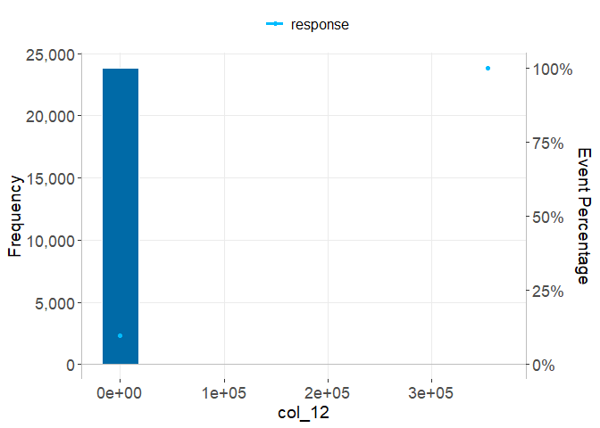

### Variable: **col_13**.

**The highest percentage of ‘response’ occurs in the interval of
‘col_13’: ‘*10078.55 - 11139.45*’, with: 100.0%**. The next highest
percentage is in the interval: ‘*530.45 - 1591.35*’, with: 66.7% (Table
1.).

### Table 1.. Count (and percentage) of rds and proportion of events for ‘responseaccording to different intervals of ’col_13’.

| col_13              | n (percentage %) | response |
|:--------------------|-----------------:|---------:|
| -530.45 - 530.45    |   23853 (100.0%) |    0.096 |
| 530.45 - 1591.35    |         3 (0.0%) |    0.667 |
| 1591.35 - 2652.25   |         0 (0.0%) |       NA |
| 2652.25 - 3713.15   |         0 (0.0%) |       NA |
| 3713.15 - 4774.05   |         0 (0.0%) |       NA |
| 4774.05 - 5834.95   |         0 (0.0%) |       NA |
| 5834.95 - 6895.85   |         0 (0.0%) |       NA |
| 6895.85 - 7956.75   |         0 (0.0%) |       NA |
| 7956.75 - 9017.65   |         0 (0.0%) |       NA |
| 9017.65 - 10078.55  |         0 (0.0%) |       NA |
| 10078.55 - 11139.45 |         1 (0.0%) |    1.000 |

### Figure 1.. Percentage of ‘response’ according to ‘col_13’ intervals.

    Warning: Removed 8 rows containing missing values or values outside the scale range
    (`geom_point()`).


### Variable: **col_14**.

**The highest percentage of ‘response’ occurs in the interval of
‘col_14’: ‘*12843.7285714286 - 14195.7*’, with: 100.0%**. The next
highest percentage is in the interval: ‘*-675.985714285714 -
675.985714285714*’, with: 9.6% (Table 1.).

### Table 1.. Count (and percentage) of rds and proportion of events for ‘responseaccording to different intervals of ’col_14’.

| col_14                               | n (percentage %) | response |
|:-------------------------------------|-----------------:|---------:|
| -675.985714285714 - 675.985714285714 |    23688 (99.3%) |    0.096 |
| 675.985714285714 - 2027.95714285714  |       112 (0.5%) |    0.045 |
| 2027.95714285714 - 3379.92857142857  |        34 (0.1%) |    0.029 |
| 3379.92857142857 - 4731.9            |        10 (0.0%) |    0.000 |
| 4731.9 - 6083.87142857143            |         6 (0.0%) |    0.000 |
| 6083.87142857143 - 7435.84285714286  |         1 (0.0%) |    0.000 |
| 7435.84285714286 - 8787.81428571428  |         3 (0.0%) |    0.000 |
| 8787.81428571428 - 10139.7857142857  |         1 (0.0%) |    0.000 |
| 10139.7857142857 - 11491.7571428571  |         1 (0.0%) |    0.000 |
| 11491.7571428571 - 12843.7285714286  |         0 (0.0%) |       NA |
| 12843.7285714286 - 14195.7           |         1 (0.0%) |    1.000 |

### Figure 1.. Percentage of ‘response’ according to ‘col_14’ intervals.

    Warning: Removed 1 row containing missing values or values outside the scale range
    (`geom_point()`).

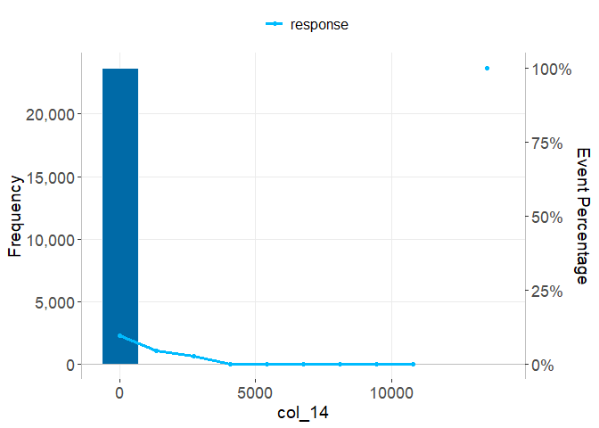

### Variable: **col_15**.

**The highest percentage of ‘response’ occurs in the interval of
‘col_15’: ‘*335831.65 - 371182.35*’, with: 100.0%**. The next highest
percentage is in the interval: ‘*-17675.35 - 17675.35*’, with: 9.6%
(Table 1.).

### Table 1.. Count (and percentage) of rds and proportion of events for ‘responseaccording to different intervals of ’col_15’.

| col_15                | n (percentage %) | response |
|:----------------------|-----------------:|---------:|
| -17675.35 - 17675.35  |   23856 (100.0%) |    0.096 |
| 17675.35 - 53026.05   |         0 (0.0%) |       NA |
| 53026.05 - 88376.75   |         0 (0.0%) |       NA |
| 88376.75 - 123727.45  |         0 (0.0%) |       NA |
| 123727.45 - 159078.15 |         0 (0.0%) |       NA |
| 159078.15 - 194428.85 |         0 (0.0%) |       NA |
| 194428.85 - 229779.55 |         0 (0.0%) |       NA |
| 229779.55 - 265130.25 |         0 (0.0%) |       NA |
| 265130.25 - 300480.95 |         0 (0.0%) |       NA |
| 300480.95 - 335831.65 |         0 (0.0%) |       NA |
| 335831.65 - 371182.35 |         1 (0.0%) |    1.000 |

### Figure 1.. Percentage of ‘response’ according to ‘col_15’ intervals.

    Warning: Removed 9 rows containing missing values or values outside the scale range
    (`geom_point()`).


### Variable: **col_16**.

**The highest percentage of ‘response’ occurs in the interval of
‘col_16’: ‘*-126.607142857143 - 126.607142857143*’, with: 9.6%**. The
next highest percentage is in the interval: ‘*126.607142857143 -
379.821428571429*’, with: 0.0% (Table 1.).

### Table 1.. Count (and percentage) of rds and proportion of events for ‘responseaccording to different intervals of ’col_16’.

| col_16                               | n (percentage %) | response |
|:-------------------------------------|-----------------:|---------:|
| -126.607142857143 - 126.607142857143 |   23850 (100.0%) |    0.096 |
| 126.607142857143 - 379.821428571429  |         5 (0.0%) |    0.000 |
| 379.821428571429 - 633.035714285714  |         0 (0.0%) |       NA |
| 633.035714285714 - 886.25            |         1 (0.0%) |    0.000 |
| 886.25 - 1139.46428571429            |         0 (0.0%) |       NA |
| 1139.46428571429 - 1392.67857142857  |         0 (0.0%) |       NA |
| 1392.67857142857 - 1645.89285714286  |         0 (0.0%) |       NA |
| 1645.89285714286 - 1899.10714285714  |         0 (0.0%) |       NA |
| 1899.10714285714 - 2152.32142857143  |         0 (0.0%) |       NA |
| 2152.32142857143 - 2405.53571428571  |         0 (0.0%) |       NA |
| 2405.53571428571 - 2658.75           |         1 (0.0%) |    0.000 |

### Figure 1.. Percentage of ‘response’ according to ‘col_16’ intervals.

    Warning: Removed 7 rows containing missing values or values outside the scale range
    (`geom_point()`).

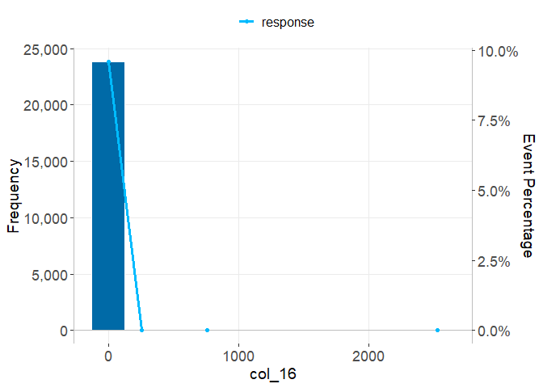

### Variable: **col_20**.

**The highest percentage of ‘response’ occurs in the interval of
‘col_20’: ‘*0.05 - 0.15*’, with: 71.4%**. The next highest percentage is
in the interval: ‘*0.35 - 0.45*’, with: 62.7% (Table 1.).

### Table 1.. Count (and percentage) of rds and proportion of events for ‘responseaccording to different intervals of ’col_20’.

| col_20       | n (percentage %) | response |
|:-------------|-----------------:|---------:|
| -0.05 - 0.05 |        27 (0.1%) |    0.593 |
| 0.05 - 0.15  |        14 (0.1%) |    0.714 |
| 0.15 - 0.25  |        31 (0.1%) |    0.613 |
| 0.25 - 0.35  |        70 (0.3%) |    0.414 |
| 0.35 - 0.45  |        67 (0.3%) |    0.627 |
| 0.45 - 0.55  |       116 (0.5%) |    0.530 |
| 0.55 - 0.65  |       160 (0.7%) |    0.531 |
| 0.65 - 0.75  |       400 (1.7%) |    0.452 |
| 0.75 - 0.85  |       522 (2.2%) |    0.433 |
| 0.85 - 0.95  |       946 (4.0%) |    0.369 |
| 0.95 - 1.05  |    21504 (90.1%) |    0.059 |

### Figure 1.. Percentage of ‘response’ according to ‘col_20’ intervals.

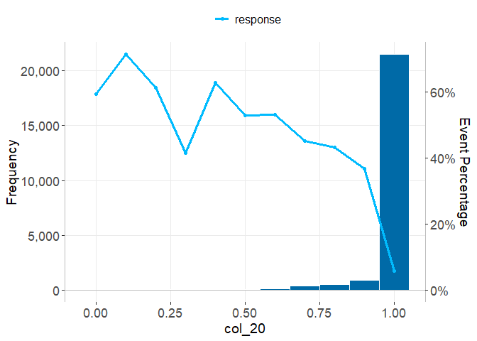

### Variable: **col_21**.

**The highest percentage of ‘response’ occurs in the interval of
‘col_21’: ‘*0.85 - 0.95*’, with: 75.0%**. The next highest percentage is
in the interval: ‘*0.55 - 0.65*’, with: 72.7% (Table 1.).

### Table 1.. Count (and percentage) of rds and proportion of events for ‘responseaccording to different intervals of ’col_21’.

| col_21       | n (percentage %) | response |
|:-------------|-----------------:|---------:|
| -0.05 - 0.05 |    21935 (91.9%) |    0.066 |
| 0.05 - 0.15  |       901 (3.8%) |    0.388 |
| 0.15 - 0.25  |       472 (2.0%) |    0.449 |
| 0.25 - 0.35  |       328 (1.4%) |    0.506 |
| 0.35 - 0.45  |        92 (0.4%) |    0.511 |
| 0.45 - 0.55  |        60 (0.3%) |    0.533 |
| 0.55 - 0.65  |        22 (0.1%) |    0.727 |
| 0.65 - 0.75  |        22 (0.1%) |    0.500 |
| 0.75 - 0.85  |         6 (0.0%) |    0.667 |
| 0.85 - 0.95  |         4 (0.0%) |    0.750 |
| 0.95 - 1.05  |        15 (0.1%) |    0.667 |

### Figure 1.. Percentage of ‘response’ according to ‘col_21’ intervals.

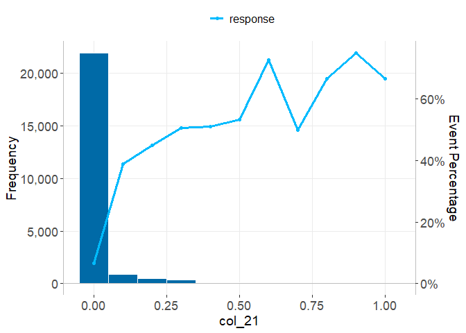

### Variable: **col_22**.

**The highest percentage of ‘response’ occurs in the interval of
‘col_22’: ‘*0.557142857142857 - 0.642857142857143*’, with: 66.7%**. The
next highest percentage is in the interval: ‘*0.728571428571429 -
0.814285714285715*’, with: 58.3% (Table 1.).

### Table 1.. Count (and percentage) of rds and proportion of events for ‘responseaccording to different intervals of ’col_22’.

| col_22                                   | n (percentage %) | response |
|:-----------------------------------------|-----------------:|---------:|
| -0.0428571428571429 - 0.0428571428571429 |    23102 (96.8%) |    0.084 |
| 0.0428571428571429 - 0.128571428571429   |       240 (1.0%) |    0.444 |
| 0.128571428571429 - 0.214285714285714    |       210 (0.9%) |    0.398 |
| 0.214285714285714 - 0.3                  |       101 (0.4%) |    0.505 |
| 0.3 - 0.385714285714286                  |        62 (0.3%) |    0.452 |
| 0.385714285714286 - 0.471428571428571    |        42 (0.2%) |    0.357 |
| 0.471428571428571 - 0.557142857142857    |        25 (0.1%) |    0.560 |
| 0.557142857142857 - 0.642857142857143    |        27 (0.1%) |    0.667 |
| 0.642857142857143 - 0.728571428571429    |        26 (0.1%) |    0.462 |
| 0.728571428571429 - 0.814285714285715    |        12 (0.1%) |    0.583 |
| 0.814285714285714 - 0.9                  |        10 (0.0%) |    0.500 |

### Figure 1.. Percentage of ‘response’ according to ‘col_22’ intervals.

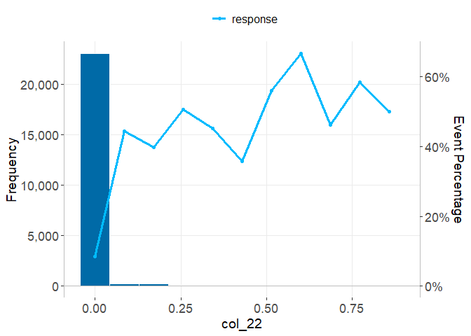

### Variable: **col_23**.

**The highest percentage of ‘response’ occurs in the interval of
‘col_23’: ‘*0.25 - 0.35*’, with: 10.4%**. The next highest percentage is
in the interval: ‘*-0.05 - 0.05*’, with: 9.8% (Table 1.).

### Table 1.. Count (and percentage) of rds and proportion of events for ‘responseaccording to different intervals of ’col_23’.

| col_23       | n (percentage %) | response |
|:-------------|-----------------:|---------:|
| -0.05 - 0.05 |    22418 (94.0%) |    0.098 |
| 0.05 - 0.15  |       183 (0.8%) |    0.060 |
| 0.15 - 0.25  |       113 (0.5%) |    0.088 |
| 0.25 - 0.35  |       106 (0.4%) |    0.104 |
| 0.35 - 0.45  |        84 (0.4%) |    0.048 |
| 0.45 - 0.55  |        80 (0.3%) |    0.088 |
| 0.55 - 0.65  |       114 (0.5%) |    0.079 |
| 0.65 - 0.75  |       118 (0.5%) |    0.076 |
| 0.75 - 0.85  |       153 (0.6%) |    0.020 |
| 0.85 - 0.95  |       139 (0.6%) |    0.086 |
| 0.95 - 1.05  |       349 (1.5%) |    0.046 |

### Figure 1.. Percentage of ‘response’ according to ‘col_23’ intervals.

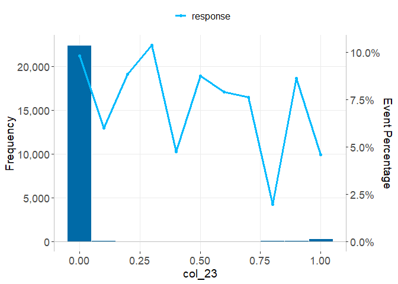

### Variable: **col_24**.

**The highest percentage of ‘response’ occurs in the interval of
‘col_24’: ‘*0.75 - 0.85*’, with: 14.3%**. The next highest percentage is
in the interval: ‘*0.55 - 0.65*’, with: 12.7% (Table 1.).

### Table 1.. Count (and percentage) of rds and proportion of events for ‘responseaccording to different intervals of ’col_24’.

| col_24       | n (percentage %) | response |
|:-------------|-----------------:|---------:|
| -0.05 - 0.05 |    22369 (93.8%) |    0.098 |
| 0.05 - 0.15  |       151 (0.6%) |    0.033 |
| 0.15 - 0.25  |        54 (0.2%) |    0.019 |
| 0.25 - 0.35  |        47 (0.2%) |    0.043 |
| 0.35 - 0.45  |        41 (0.2%) |    0.049 |
| 0.45 - 0.55  |        10 (0.0%) |    0.000 |
| 0.55 - 0.65  |        55 (0.2%) |    0.127 |
| 0.65 - 0.75  |        57 (0.2%) |    0.105 |
| 0.75 - 0.85  |         7 (0.0%) |    0.143 |
| 0.85 - 0.95  |       221 (0.9%) |    0.059 |
| 0.95 - 1.05  |       845 (3.5%) |    0.067 |

### Figure 1.. Percentage of ‘response’ according to ‘col_24’ intervals.

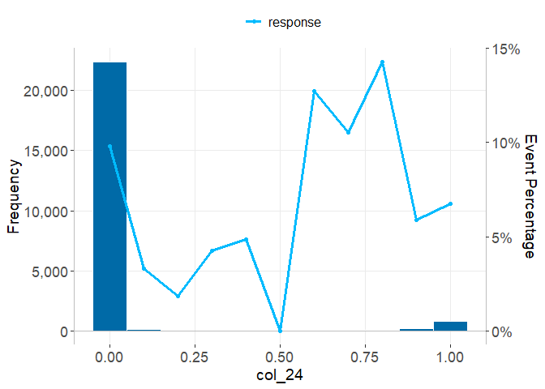

### Variable: **col_25**.

**The highest percentage of ‘response’ occurs in the interval of
‘col_25’: ‘*0.95 - 1.05*’, with: 68.3%**. The next highest percentage is
in the interval: ‘*0.85 - 0.95*’, with: 58.2% (Table 1.).

### Table 1.. Count (and percentage) of rds and proportion of events for ‘responseaccording to different intervals of ’col_25’.

| col_25       | n (percentage %) | response |
|:-------------|-----------------:|---------:|
| -0.05 - 0.05 |    20544 (86.1%) |    0.049 |
| 0.05 - 0.15  |      1084 (4.5%) |    0.278 |
| 0.15 - 0.25  |       257 (1.1%) |    0.346 |
| 0.25 - 0.35  |       695 (2.9%) |    0.401 |
| 0.35 - 0.45  |       434 (1.8%) |    0.429 |
| 0.45 - 0.55  |        80 (0.3%) |    0.475 |
| 0.55 - 0.65  |       298 (1.2%) |    0.500 |
| 0.65 - 0.75  |       209 (0.9%) |    0.426 |
| 0.75 - 0.85  |        28 (0.1%) |    0.536 |
| 0.85 - 0.95  |       165 (0.7%) |    0.582 |
| 0.95 - 1.05  |        63 (0.3%) |    0.683 |

### Figure 1.. Percentage of ‘response’ according to ‘col_25’ intervals.


### Variable: **col_26**.

**The highest percentage of ‘response’ occurs in the interval of
‘col_26’: ‘*0.814285714285714 - 0.9*’, with: 58.7%**. The next highest
percentage is in the interval: ‘*0.557142857142857 -
0.642857142857143*’, with: 47.1% (Table 1.).

### Table 1.. Count (and percentage) of rds and proportion of events for ‘responseaccording to different intervals of ’col_26’.

| col_26                                   | n (percentage %) | response |
|:-----------------------------------------|-----------------:|---------:|
| -0.0428571428571429 - 0.0428571428571429 |    22825 (95.7%) |    0.081 |
| 0.0428571428571429 - 0.128571428571429   |         0 (0.0%) |       NA |
| 0.128571428571429 - 0.214285714285714    |       319 (1.3%) |    0.373 |
| 0.214285714285714 - 0.3                  |       171 (0.7%) |    0.368 |
| 0.3 - 0.385714285714286                  |        31 (0.1%) |    0.355 |
| 0.385714285714286 - 0.471428571428571    |       166 (0.7%) |    0.416 |
| 0.471428571428571 - 0.557142857142857    |        22 (0.1%) |    0.409 |
| 0.557142857142857 - 0.642857142857143    |       119 (0.5%) |    0.471 |
| 0.642857142857143 - 0.728571428571429    |        88 (0.4%) |    0.455 |
| 0.728571428571429 - 0.814285714285715    |         7 (0.0%) |    0.429 |
| 0.814285714285714 - 0.9                  |       109 (0.5%) |    0.587 |

### Figure 1.. Percentage of ‘response’ according to ‘col_26’ intervals.

    Warning: Removed 1 row containing missing values or values outside the scale range
    (`geom_point()`).

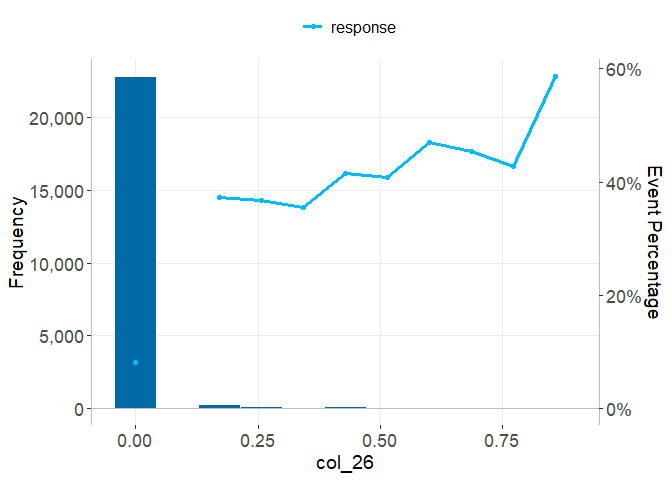
